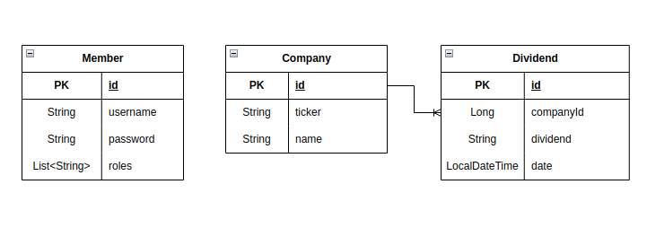

# 스크래핑을 이용해 저장한 데이터를 반환하는 프로젝트

## 기술
- Spring Boot
- Java
- JPA
- H2
- Redis
- Jsoup
- Jwt

## 프로젝트 소개
- Jsoup을 이용해 미국 주식 배당금 정보를 스크래핑해 데이터에 저장
- 캐시의 필요성을 이해하고 캐시 서버를 구성  
캐싱이 필요한가?  
 -> 요청이 자주 들어오는가? Y  
 -> 자주 변경되는 데이터 인가? N  
 => redis 에 저장되면 repository를 이용해 가져오지않고 캐시서버에서 가져옴  
- Jwt를 이용해 안전한 인증 & 권한허가

## Erd

## API
1. 해당 회사의 정보와 배당금 정보 반환 : GET - finance/dividend/{companyName}
- 회사가 없는 경우 스크래핑을 활용해 데이터베이스에 정보 저장후 반환
- 파라미터 : 회사이름
- 결과
- 성공 : 메타 정보, 배당금 정보 
- 실패 : 회사명이 없는 경우(400, "존재하지 않는 회사명입니다.")

2. 회사 검색 기능 (자동완성) : GET - company/autocomplete
- Trie를 이용한 방법과 jpa를 이용한 방법 2가지 구현
- 파라미터 : 회사이름의 일부
- 결과
- 성공 : 회사 이름(10개)
- 실패 : 회사명이 없는 경우(400, "키워드가 포함된 회사명이 없습니다.")

3. 전체 회사 리스트 가져오기 : GET - company
- 파라미터 : 없음
- 결과
- 성공 : 모든 회사 목록을 Page 인터페이스 형태로 반환
- 실패 : 저장된 회사가 없는 경우(400, "저장된 회사가 없습니다.")

4. 새로운 회사 정보 추가 : POST - company
- 추가하고자 하는 회사의 ticker 를 입력으로 받아 해당 회사의 정보를 스크래핑하고 저장
- 파라미터 : ticker
- 결과
- 성공 : ticker
- 실패 : 이미 보유하고있는 회사인 경우(400, "이미 정보가 존재하는 회사입니다."), 존재하지 않는 회사 ticker 일 경우(400, "Ticker에 해당하는 회사가 없습니다."), ticker정보가 없는 경우("Ticker 정보가 존재하지 않습니다."), scrap실패한 경우("Scrap을 실패하였습니다.")
 
5. ticker 에 해당하는 회사 정보 삭제 : DELETE - company/{ticker}
- 삭제시 회사의 배당금 정보와 캐시도 모두 삭제되어야 함
- 파라미터 : ticker
- 결과
- 성공 : ticker
- 실패 : ticker에 해당하는 회사가 없는 경우(400, "존재하지 않는 회사명입니다.")

6. 회원가입 : POST - auth/signup
- 비밀번호는 암호화된 형태로 저장 
- 파라미터 : email, password
- 결과
- 성공 : email, password
- 실패 : 이메일이 이미 존재할 경우(400, "이미 존재하는 사용자명입니다.")

6. 로그인 : POST - auth/signin
- 회원가입이 되어있고, 아이디/패스워드 정보가 옳은 경우 JWT 발급
- 파라미터 : email, password
- 결과
- 성공 : token
- 실패 : 이메일 없는 경우(400, "가입되지 않은 사용자명입니다."), 이메일과 비밀번호가 틀린 경우(400, "비밀번호가 일치하지 않습니다.")

